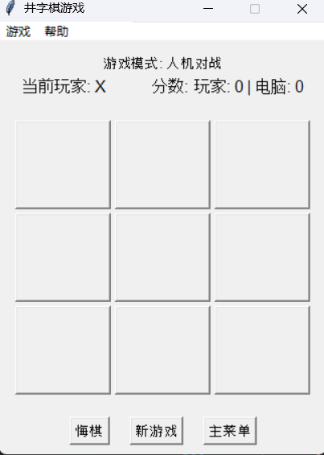

# 井字棋游戏开发文档

## 项目概述

本项目是一个使用Python和Tkinter库开发的图形界面井字棋游戏。游戏支持玩家与玩家对战或玩家与电脑对战，并提供悔棋、记分、重新开始等功能。

## 功能实现

### 1. 游戏对战功能

实现了基础的井字棋对战逻辑，包括：
- 3x3棋盘界面
- 玩家X和玩家O轮流下棋
- 自动判断胜负和平局
- 获胜时高亮显示获胜路径

**实现方法**：
- 使用数组存储棋盘状态
- 通过Tkinter按钮网格表示棋盘
- 编写算法检查水平、垂直和对角线上是否有三个相同标记

### 2. 悔棋功能

允许玩家撤销上一步操作：
- 恢复棋盘到上一步状态
- 切换回之前的玩家
- 继续游戏

**实现方法**：
- 使用列表记录每一步的位置和玩家信息
- 实现undo_move方法移除最后一步并更新界面
- 在人机对战模式下，一次撤销两步（玩家和AI的）

### 3. 重新开始游戏功能

随时可以重置游戏状态：
- 清空棋盘
- 重置游戏标记
- 保留得分记录

**实现方法**：
- 实现new_game方法清空棋盘数据和界面显示
- 重置游戏状态变量但保留分数

### 4. 记分功能

跟踪两位玩家的获胜次数：
- 显示X和O的得分
- 每局结束自动更新

**实现方法**：
- 使用变量跟踪每个玩家的得分
- 玩家获胜时增加对应分数
- 在界面上实时显示得分

### 5. 游戏开始界面

新增游戏开始界面，提供更多游戏选项：
- 选择游戏模式（双人对战/人机对战）
- 选择AI难度（简单/中等/困难）
- 选择先手玩家（玩家/电脑）

**实现方法**：
- 创建独立的开始界面函数
- 使用单选按钮和下拉菜单实现选项选择
- 将用户选择的参数传递给游戏初始化函数

### 6. AI对战功能

实现了三种不同难度的AI对手：
- 简单：随机选择空位
- 中等：70%几率使用高级策略，30%几率随机选择
- 困难：使用策略算法寻找最佳位置

**实现方法**：
- 简单AI：使用随机算法选择空位
- 困难AI：使用策略优先级（获胜位置 > 阻止玩家获胜 > 中心 > 角落 > 边缘）
- 中等AI：结合两种算法，增加随机性

## 详细开发过程

### 项目规划与设计阶段

**需求分析与设计**

项目开始时，首先确定了开发井字棋游戏的基本需求，列出了四项核心功能：
1. 基本的游戏对战逻辑
2. 悔棋功能
3. 新游戏重置功能
4. 记分功能

在这一阶段，向AI提出了第一个关键提示："**实现一款完整软件的开发，要求具备至少4个功能，例如增、删、改、查，具备图形化界面，开发一款井字棋游戏**"。AI根据这一需求建议使用Python和Tkinter作为开发工具，因其轻量级且跨平台特性适合小型游戏项目，并提供了初步的界面布局设计。

**基础架构设计**

基于AI的建议，确定了代码的整体架构。采用面向对象的方式，设计`TicTacToeGame`类来封装游戏的所有逻辑和UI元素。设计了主要的数据结构：
- 使用一个长度为9的一维数组来表示3×3的棋盘
- 使用列表记录游戏历史步骤
- 使用变量跟踪当前玩家、游戏状态和得分

这个阶段向AI提出的关键提示是："**设计井字棋游戏的基本架构，包括数据结构和主要函数**"。

### 编码实现阶段

**基本游戏功能实现**

首先实现了基本的UI框架和棋盘显示。这部分完全依赖AI生成代码，提示词为："**创建井字棋游戏的基本UI界面和棋盘显示，使用Tkinter**"。AI生成了以下基础UI代码：

```python
# AI生成的基础UI代码示例
def create_board_frame(self):
    self.board_frame = tk.Frame(self.root)
    self.board_frame.pack(pady=10)
    
    self.buttons = []
    for i in range(3):
        for j in range(3):
            button = tk.Button(self.board_frame, text="", font=('Arial', 20, 'bold'),
                             width=5, height=2)
            button.grid(row=i, column=j, padx=2, pady=2)
            self.buttons.append(button)
```

然后，为实现游戏的核心逻辑，向AI提出了如下提示：
1. "**实现井字棋的点击处理和玩家切换功能**" - 生成了`make_move`方法
2. "**如何判断井字棋游戏中的获胜条件**" - 生成了`check_winner`函数

```python
def check_winner(self):
    win_patterns = [
        [0, 1, 2], [3, 4, 5], [6, 7, 8],  # 横行
        [0, 3, 6], [1, 4, 7], [2, 5, 8],  # 纵列
        [0, 4, 8], [2, 4, 6]              # 对角线
    ]
    
    for pattern in win_patterns:
        if (self.board[pattern[0]] == self.board[pattern[1]] == 
            self.board[pattern[2]] != ""):
            return True
    return False
```

**悔棋功能实现**

悔棋功能是一个相对复杂的功能，涉及游戏状态回溯。向AI提出了明确的需求："**实现井字棋的悔棋功能，需要能够撤销上一步操作并恢复游戏状态**"。

AI建议采用记录移动历史的方法，每次移动时将位置和玩家信息存入历史记录列表，并提供了以下代码：

```python
# 记录移动历史的代码
self.moves_history.append((index, self.current_player))
```

而后，AI还生成了完整的悔棋功能实现：

```python
def undo_move(self):
    if not self.moves_history:
        return
    
    last_move = self.moves_history.pop()
    index = last_move[0]
    
    # 更新棋盘
    self.board[index] = ""
    self.buttons[index].config(text="", bg="SystemButtonFace")
    
    # 切换回上一个玩家
    self.current_player = last_move[1]
    self.player_label.config(text=f"当前玩家: {self.current_player}")
    
    # 如果游戏已结束但进行了悔棋，则继续游戏
    self.game_over = False
```

在测试阶段，发现了一个问题：当有玩家获胜且棋盘上有高亮显示时，悔棋后高亮没有被清除。向AI提出了问题："**悔棋后棋盘高亮没有被清除**"，获得了添加额外代码重置按钮背景色的解决方案。

**重新开始与记分功能**

这一阶段向AI提出了两个功能需求：
1. "**实现井字棋的重新开始游戏功能**"
2. "**实现玩家得分记录和显示功能**"

AI生成了`new_game`方法清空棋盘状态和界面：

```python
def new_game(self):
    # 重置棋盘
    self.board = [""] * 9
    for button in self.buttons:
        button.config(text="", bg="SystemButtonFace")
        
    # 重置游戏状态
    self.current_player = "X"
    self.moves_history = []
    self.game_over = False
    self.player_label.config(text="当前玩家: X")
```

以及`update_score`方法更新并显示得分：

```python
def update_score(self):
    self.score_label.config(text=f"X: {self.x_score} | O: {self.o_score}")
```

**游戏开始界面与AI对战**

为了提升游戏体验，提出了新的功能需求："**增加游戏开始界面和ai对战选项，尝试开发ai对战功能**"。

AI首先生成了游戏开始界面的代码，然后实现了三种难度级别的AI对战：

1. **简单AI**：随机选择空位
   ```python
   def ai_easy_move(self):
       empty_cells = [i for i, cell in enumerate(self.board) if cell == ""]
       return random.choice(empty_cells)
   ```

2. **困难AI**：基于策略优先级的算法，AI通过检查可能的获胜位置、阻止玩家获胜、占据中心等策略做出决策。

3. **中等AI**：结合简单和困难策略
   ```python
   def ai_medium_move(self):
       if random.random() < 0.7:
           return self.ai_hard_move()
       else:
           return self.ai_easy_move()
   ```

针对人机对战模式下的悔棋功能，AI提供了特殊处理逻辑，一次撤销两步（玩家的和电脑的）而不是一步：

```python
if self.game_mode == "pvc" and len(self.moves_history) >= 2 and not self.game_over:
    # 在人机模式下，需要撤销两步（玩家的和电脑的）
    for _ in range(2):
        if self.moves_history:
            last_move = self.moves_history.pop()
            index = last_move[0]
            self.board[index] = ""
            self.buttons[index].config(text="", bg="SystemButtonFace")
```

**测试、调试与优化**

在项目最后阶段，提出了一些问题和优化需求：
1. "**在人机对战模式下，如何让电脑先手**"
2. "**如何处理AI可能遇到的错误情况**"
3. "**如何优化游戏界面响应性**"

AI提供了多项解决方案，包括：
1. 添加检测逻辑使电脑能自动走第一步
2. 为AI策略添加额外的错误处理和安全检查
3. 添加延迟模拟AI思考，提升用户体验

```python
# 添加短暂延迟模拟AI思考
self.root.after(500, self.ai_make_move)
```

此外，AI还完善了游戏规则说明、菜单栏功能，并进行了代码重构和注释，提高了代码的可读性和可维护性。

### AI与人工协作过程

本项目主要由AI完成代码实现，人工则负责提供需求、测试和反馈。具体分工如下：

**AI完成部分**：
- 生成全部基础代码结构和功能实现
- 提供UI布局和组件设计
- 实现游戏核心逻辑和算法
- 开发AI对战功能的各种难度级别
- 解决特定问题和bug修复
- 提供代码优化和重构建议

**人工完成部分**：
- 明确需求和功能规划
- 提供具体的功能需求描述
- 测试AI生成的代码
- 发现并报告问题
- 提出改进和扩展功能的建议

**关键人工提示词**：
1. "实现一款完整软件的开发，要求具备至少4个功能，具备图形化界面，开发一款井字棋游戏"
2. "设计井字棋游戏的基本架构，包括数据结构和主要函数"
3. "创建井字棋游戏的基本UI界面和棋盘显示，使用Tkinter"
4. "实现井字棋的点击处理和玩家切换功能"
5. "如何判断井字棋游戏中的获胜条件" 
6. "实现井字棋的悔棋功能，需要能够撤销上一步操作并恢复游戏状态"
7. "悔棋后棋盘高亮没有被清除，如何解决"
8. "实现井字棋的重新开始游戏功能"
9. "实现玩家得分记录和显示功能"
10. "增加游戏开始界面和ai对战选项，尝试开发ai对战功能"
11. "在人机对战模式下，如何让电脑先手"
12. "如何处理AI可能遇到的错误情况"
13. "如何优化游戏界面响应性"

通过以上合作方式，成功开发出了一款功能完善、用户体验良好的井字棋游戏。

## 软件运行效果

 

*游戏开始界面*

 

*游戏初始界面*

 

*游戏进行中*

 

*人机对战模式*

 

*玩家获胜状态*

 

*平局状态*

## 总结与反思

### 项目成果
本项目成功实现了一个具有完整功能的井字棋游戏。从设计到实现，注重了用户体验和代码结构的清晰性。添加了开始界面和AI对战功能，大大增强了游戏的可玩性和用户体验。

### 技术收获
通过本项目，获得了以下技术知识和经验：
1. Tkinter库的使用和界面设计技巧
2. 游戏状态管理和历史记录追踪方法
3. 事件处理和用户交互实现
4. 基础游戏AI算法设计
5. Python面向对象编程实践
6. 软件测试和调试方法
7. 如何有效利用AI辅助编程

### 挑战与解决方案
项目中最大的挑战是实现困难级别的AI算法。初期尝试实现完整的Minimax算法，但在井字棋这种简单游戏中显得过于复杂。经过研究和与AI讨论，采用了策略优先级的方法，既保证了AI的竞争力，又减少了复杂性。

另一个挑战是处理游戏状态的连贯性，特别是在悔棋和重新开始功能中。通过向AI提出具体问题，获得了合理的状态管理和历史记录解决方案。

### 未来改进
未来可能的改进方向：
1. 实现真正的Minimax算法或Alpha-Beta剪枝算法提升AI智能
2. 添加音效和更多视觉效果增强游戏体验
3. 实现游戏数据的本地存储功能，保存游戏记录和玩家统计
4. 添加更多游戏设置选项，如棋盘大小、获胜条件等
5. 开发联网对战功能

## 运行说明

### 环境要求
- Python 3.6+
- Tkinter库（Python标准库，通常已预装）

### 运行方法
```bash
python tictactoe.py
```
